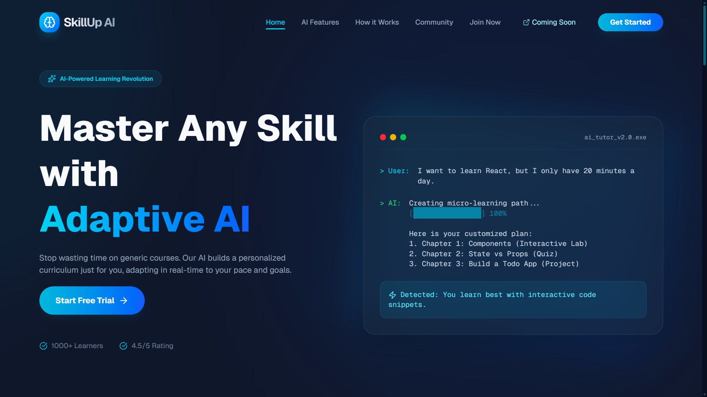
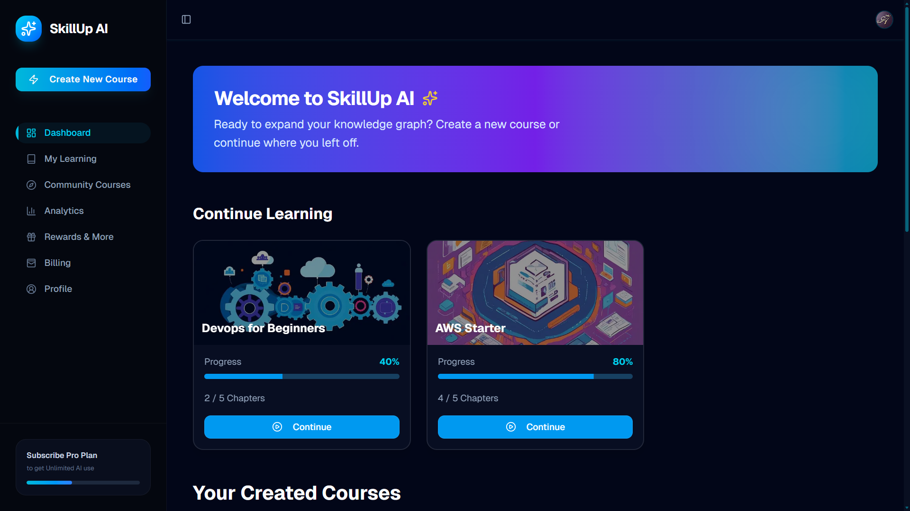

# SkillUp AI - NextGen Learning Platform 🚀





> **_“Unlock Your Potential with AI-Driven Learning Paths.”_**  
> — **SkillUp AI Platform**

---

**SkillUp** is a state-of-the-art AI-powered learning platform designed to revolutionize how individuals create and consume educational content. By integrating advanced AI models like **Google Gemini**. SkillUp transforms simple user prompts into comprehensive, structured courses complete with video tutorials and progress tracking.

---

## 📑 Table of Contents

1.  [Project Overview](#-project-overview)
2.  [Key Features](#-key-features)
3.  [Tech Stack](#️-tech-stack)
4.  [System Architecture](#️-system-architecture)
5.  [Getting Started](#-getting-started)
6.  [Folder Structure](#-folder-structure)
7.  [API Reference](#-api-reference)
8.  [Contribution Guidelines](#-contribution-guidelines)

---

## ScreenShots

  

### Preview: [Go Live](https://skillup-in.vercel.app/)

---

## 🌟 Project Overview

In today's fast-paced world, finding structured learning resources for niche topics can be challenging. **SkillUp** solves this by generating custom courses on-demand.

Users simply enter a topic (e.g., "Advanced React Patterns"), and the system:
1.  **analyzes** the request using Google Gemini.
2.  **structures** a complete curriculum with chapters.
3.  **generates** detailed text content for each chapter.
4.  **curates** relevant YouTube videos for visual learning.
5.  **designs** a custom course banner using Flux AI.

This creates a personalized "Zero to Hero" learning path in seconds, tracked via a robust user dashboard.

---

## ✨ Key Features

*   **🤖 Intelligent Course Generation**
    *   Leverages Google Gemini 2.5 Flash to create logical, step-by-step course outlines.
    *   Generates rich content for individual chapters, including code snippets and explanations.
*   **▶️ Smart Video Curation**
    *   Automatically searches and embeds the most relevant YouTube videos for each specific chapter using the YouTube Data API.
*   **🔐 Secure & Seamless Auth**
    *   Enterprise-grade authentication using Clerk, supporting email, Google, and GitHub logins.
*   **📊 Interactive Dashboard**
    *   Real-time progress tracking (percentage completed).
    *   "My Courses" view to manage enrolled and created courses.
*   **📝 Community Courses**
    *   Access to courses created by other users.
    *   Ability to enroll in and track progress on community courses.
*   **🎨 AI-Powered Visuals**
    *   Integrates with Flux AI (via custom API) to generate unique, high-quality course thumbnails based on the course topic.
*   **💳 Freemium Model Logic**
    *   Logic implemented to limit free users to a specific number of course generations (upgradeable architecture).
*   **🚀 Upcoming Features**
    *   Features like Analytics, Character based AI Chatbot, learning achievements, Adaptive Quizzes, Course Completion Certificates, etc.
---

## 🛠️ Tech Stack

### 🎨 Frontend
| Technology | Description |
| :--- | :--- |
| **Next.js 16** | The React Framework for the Web. Used for App Router, Server Components, and API Routes. |
| **React 19** | JavaScript library for building user interfaces. |
| **Tailwind CSS** | A utility-first CSS framework for rapid UI development. |
| **Shadcn UI** | A collection of ready-to-use components built with Radix UI and Tailwind CSS. |
| **Framer Motion** | Production-ready motion library for React animations. |
| **Lucide React** | Beautiful & consistent icons. |

### 🔙 Backend
| Technology | Description |
| :--- | :--- |
| **Next.js API Routes** | Serverless functions handling business logic, database interactions, and AI calls. |
| **Clerk** | Handles User Authentication, Session Management, and Role-Based Access Control. |
| **Google Gemini API** | The core intelligence engine for generating course layouts and detailed content. |
| **YouTube Data API** | Fetches video metadata for course chapters. |

### 🗄️ Database & Storage
| Technology | Description |
| :--- | :--- |
| **PostgreSQL (Neon)** | Serverless, scalable PostgreSQL database. |
| **Drizzle ORM** | Lightweight TypeScript ORM for type-safe database queries. |
| **Drizzle Kit** | CLI tool for database migrations and schema management. |

---

## 🏗️ System Architecture

The application follows a modern **Serverless Architecture** enabled by Next.js.

### High-Level Data Flow

1.  **User Request:**
    *   User submits a topic (e.g., "Python for AI").
    *   Frontend sends a `POST` request to `/api/generate-course-layout`.
2.  **Course Layout Generation:**
    *   Server validates user limits (Free vs Pro).
    *   Server calls **Google Gemini** with a prompt to generate a JSON structure (Chapters, Descriptions).
    *   Server calls **Flux API** to generate a banner image.
    *   Draft course is saved to **Neon DB** via Drizzle.
3.  **Course Content Generation (Streaming/Async):**
    *   Frontend triggers content generation for chapters.
    *   **Google Gemini** generates the text content.
    *   **YouTube API** fetches a matching video.
    *   Content is updated in the DB.
4.  **Enrollment & Progress:**
    *   Users "enroll" in courses. This creates a record in the `user_enrollments` table.
    *   As chapters are marked "Complete", the frontend updates certain flags in the DB.

```mermaid
graph TD
    User[User Client] -->       |Auth|          Clerk[Clerk Auth]
    User              -->    |API Request|      NextAPI[Next.js API Routes]
    
    NextAPI           -->    |Query/Mutate|     DB[(Neon PostgreSQL)]
    NextAPI           -->    |Generate Text|    Gemini[Google Gemini AI]
    NextAPI           -->    |Generate Image|   Flux[Flux AI API]
    NextAPI           -->    |Search Video|     YT[YouTube API]
    
    DB                -->    |Return Data|      NextAPI
    NextAPI           -->    |JSON Response|    User
```

---

## 🚀 Getting Started

### Prerequisites
*   **Node.js** v18+
*   **npm** or **yarn**
*   **Neon Database** account (for PostgreSQL)
*   **Clerk** account
*   **Google AI Studio** key (Gemini)
*   **Google Cloud Console** key (YouTube Data API)

### 1. Clone & Install
```bash
git clone https://github.com/saksham2882/skillup-ai.git
cd skillup-ai
npm install
```

### 2. Environment Variables
Create a `.env.local` file in the root. **This is critical** for the app to function.

| Variable | Description |
| :--- | :--- |
| `NEXT_PUBLIC_CLERK_PUBLISHABLE_KEY` | Your Clerk Publishable Key. |
| `CLERK_SECRET_KEY` | Your Clerk Secret Key. |
| `NEXT_PUBLIC_CLERK_SIGN_IN_URL` | `/sign-in` |
| `NEXT_PUBLIC_CLERK_SIGN_UP_URL` | `/sign-up` |
| `NEXT_PUBLIC_CLERK_SIGN_IN_FALLBACK_REDIRECT_URL` | `/workspace` |
| `NEXT_PUBLIC_CLERK_SIGN_UP_FALLBACK_REDIRECT_URL` | `/workspace` |
| `DATABASE_URL` | Neon Connection String (e.g., `postgresql://...`). |
| `GEMINI_API_KEY` | Key from Google AI Studio. |
| `AI_GURU_LAB_API` | Custom API key for image generation. |
| `YOUTUBE_API_KEY` | Key from Google Cloud Console (YouTube Data v3). |

### 3. Database Setup
Push the schema to your Neon database instance:
```bash
npm run db:push
```

### 4. Run Development Server
```bash
npm run dev
```

---

## 📂 Folder Structure

A detailed look at the project structure:

```
skillup/
├── .next/                               # Build output (do not edit)
├── app/                                 # Next.js App Router
│   ├── (auth)/                          # Route groups for Clerk pages (sign-in/up)
│   ├── api/                             # API Routes (Backend logic)
│   │   ├── courses/                     # Get course list logic
│   │   ├── enroll-course/               # Enrollment logic
│   │   ├── generate-course-content/     # AI Content Gen logic
│   │   ├── generate-course-layout/      # AI Layout Gen logic
│   │   └── user/                        # User syncing logic
│   ├── course/[courseId]/               # Dynamic route for viewing a course
│   ├── workspace/                       # User Dashboard protected route
│   ├── layout.js                        # Root layout (Provider wrapping)
│   └── page.js                          # Landing page
├── components/                          # Reusable UI Components
│   ├── ui/                              # Atomic Shadcn/Radix components (Button, Input)
│   ├── Header.jsx                       # Main navigation bar
│   └── Hero.jsx                         # Landing page hero section
├── config/                              # Configurations
│   ├── db.js                            # Drizzle DB connection setup
│   └── schema.js                        # Database schema definitions
├── lib/                                 # Utilities
│   ├── prompt.js                        # Prompts for Gemini AI
│   └── utils.js                         # Helper functions (clsx, date format)
├── public/                              # Static assets (images, icons)
├── .env.local                           # Environment variables
├── drizzle.config.js                    # Drizzle Kit config
├── middleware.ts                        # Clerk Auth Middleware
└── package.json                         # Dependencies & Scripts
```

---

## 🔌 API Reference

### 1. Create User
**Endpoint:** `POST /api/user`
**Description:** Checks if a user exists; if not, creates a new user record in the database.
*   **Request Body:**
    ```json
    {
      "email": "user@example.com",
      "name": "John Doe"
    }
    ```
*   **Response (200/201):**
    ```json
    {
      "message": "User created successfully",
      "user": { ... }
    }
    ```

### 2. Generate Course Layout
**Endpoint:** `POST /api/generate-course-layout`
**Description:** Generates the skeleton of a course (chapters, title, difficulty, no of chapters, include video, category) and the course banner.
*   **Request Body:**
    ```json
    {
      "courseId": "uuid-v4-string",
      "name": "Introduction to Python",
      "description": "Learn Python from scratch",
      "noOfChapters": 5,
      "includeVideo": "yes",
      "level": "Beginner",
      "category": "Programming",
    }
    ```
*   **Response (200):**
    ```json
    {
      "courseId": "uuid-v4-string"
    }
    ```
*   **Error (403):** If a free user exceeds their limit.

### 3. Generate Chapter Content
**Endpoint:** `POST /api/generate-course-content`
**Description:** Generates detailed text content and finds a video for a specific chapter.
*   **Request Body:**
    ```json
    {
      "courseId": "course-uuid",
      "courseJson": { ... } // Contains chapter names
    }
    ```
*   **Response (200):**
    ```json
    {
      "success": true,
      "content": [
        {
          "courseData": { "content": "HTML string..." },
          "youtubeVideo": [ { "videoId": "..." } ]
        }
      ]
    }
    ```

### 4. Enroll in Course
**Endpoint:** `POST /api/enroll-course`
**Description:** Enrolls the current user in a course.
*   **Request Body:** `{"courseId": "..."}`
*   **Response (200):** Enrollment object.

---

## 🤝 Contribution Guidelines

We love contributions! Please follow these steps to contribute:

1.  **Fork the Repository:** Click the "Fork" button at the top right of this page.
2.  **Clone your Fork:**
    ```bash
    git clone https://github.com/YOUR_USERNAME/skillup-ai.git
    ```
3.  **Create a Branch:**
    ```bash
    git checkout -b feature/amazing-feature
    ```
4.  **Make Changes:** Write your code and commit it.
    ```bash
    git commit -m "Add Amazing Feature"
    ```
5.  **Push to Branch:**
    ```bash
    git push origin feature/amazing-feature
    ```
6.  **Open a Pull Request:** Go to the original repo and click "New Pull Request".


- Please ensure your code follows the existing style and linting rules!

---

## 🔗Contact Me

-   **Email:**  [agrahari0899@gmail.com](mailto:agrahari0899@gmail.com)
-   **GitHub:** [@saksham2882](https://github.com/saksham2882)
-   **LinkedIn:** [@saksham-agrahari](https://www.linkedin.com/in/saksham-agrahari/)
-   **Portfolio:** [saksham-agrahari.vercel.app](https://saksham-agrahari.vercel.app)

---

<p align="center">
  Made with ❤️ by Saksham
</p>
